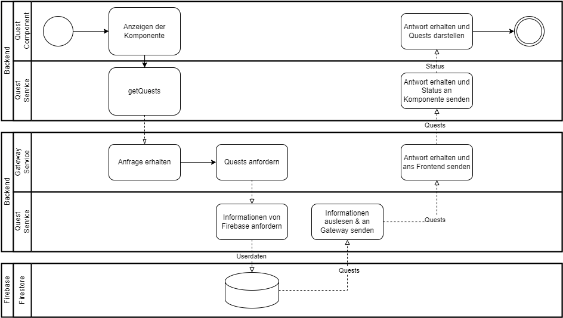

# Architekturdokumentaiton

## Inhalt

## Einführung und Ziele

### Aufgabenstellung
Das Projekt QuestManager wurde im Rahmen meines HSLU-Informatikstudiums entwickelt. Es wurde im Modul WEBLAB initial erstellt und im Modul SWAT überarbeitet.
Die Aufgabenstellung wurde zu Beginn des Projektes erstellt und ist in einem separaten Dokument festgehalten. Viele der Stories konnten nicht wie geplant umgesetzt werden. Details dazu sind in diesem Dokument und in der Reflexion aufgeführt.

#### User Stories
* Anmelden Quest-Manager

Als Benutzer kann ich mich am Quest-Manager anmelden, damit ich Quests und Fortschritte verwalten kann.

* Erfassen einer Quest

Als Admin kann ich eine Quest erfassen, damit die User sie aktivieren können.

* Bearbeiten einer Quest
 
Als Admin kann ich eine erfasste Quest bearbeiten, damit ich fehlerhafte oder veraltete Informationen korrigieren kann.
* Löschen einer Quest

Als Admin kann ich eine Quest löschen, damit veraltete Informationen nicht mehr im System vorhanden sind.

### Geplant

* Anzeigen von aktiven Quests

Als User kann ich meine aktiven Quests anzeigen, damit ich einen Überblick über diese habe.

* Aktivieren einer Quest

Als User kann ich eine Quest für mich aktivieren, damit sie als aktive Quest aufgeführt wird.

* Fortschritt eines Quest-Task erfassen

Als User kann ich den Fortschritt meiner aktiven Quests bearbeiten, damit ich diesen beobachten kann.

#### Stakeholder
Die Stakeholder des Projekts sind folgende:
* Dozenten Modul WEBLAB Herbstsemester 23
* Entwickler
* Benutzer der Applikation, normalerweise Spieler des Spieles Escape From Tarkov.

## Randbedingungnen
Das Projekt wurde im Rahmen der WEBLAB Blockwoche erstellt. Dabei wurden nicht viele Vorgaben gegeben. Die Definition der User Stories wurde aus einer eigenen Projektidee erstellt. Die Anforderungen wurden in einem separaten Dokument festgehalten und im Kapitel User Stories aufgelistet.

Der Projektauftrag des Modules schreibt/schlägt folgendes vor:
* Das Backend soll in einer Microservice-Architektur aufgebaut sein;
* Es sollen für den Entwickler neue Frameworks verwendet werden;
* Die Dokumentation sollte nach arc42 gegliedert sein;
* Der Aufwand für Umsetzung und Dokumentation sollte mindestens 60 Stunden betragen;
* Das Projekt inklusive Dokumentation muss bis am 28.02.2024 18:00 Uhr beendet und abgegeben sein.
  
## Lösungsstrategie
Das Quest Manager System besteht aus drei Schichten, bestehend aus Frontend, Backend und Datenbank. Für die Persistenz wird Firebase verwendet.

Das Backend ist in einer Microservice Architektur mit Node.js umgesetzt. Es besteht aus vier Microservices. Eingehende Anfragen vom Frontend werden vom Gateway empfangen und an die entsprechenden Microservices weitergeleitet. Diese haben jeweils ihre eigenen Datenbanken.

Das Frontend ist eine mit Angular umgesetzte Single-Page-Applikation.

## Bausteinsicht
### Ebene 1

### Ebene 2

### Ebene 3

## Laufzeitsicht
Um die Dokumentation kürzer zu halten, wurden nur die Abläufe mit höherer Komplexität dargestellt.

**Register Prozess**
Beim Login und Logout Prozess verwendet Frontend Auth Service direkt den Firebase Authentification Service.

**Get Quests**

Add/ Update Quest verläuft ähnlich.

## Verteilungssicht
Die Microservices können einzeln Deployed werden funktionieren aber nur im Zusammenspiel gemäss der Lösungsstrategie. Die Endpoints der jeweiligen Services sind als **API-Dokumentation** in den jeweiligen Repositorys als markdown-File dokumentiert.

Hinweis: Das System wurde noch nicht bereitgestellt und funktioniert entsprechend der in "local environment" dargestellten Lokalverteilung. Das Deployment kann lokal in Docker erfolgen.

## Querschnittliche Konzepte

### Security und Safety
Die Sicherheit der Passwörter und Userdaten auf der Datenbank ist durch die Umsetzung auf Basis von Google Firebase gewährleistet.
### Konfiguration des Systems
**Backend:** Die Konfiguration der Datenbank API und der Ports sind, für jeden Microservice, in einem .env-File gespeichert. Die URLs in der Docker-Umgebung werden im Gateway Service in einem docker.env-File definiert.
**Frontend:** Die Konfigurationen der Datenbank API werden im environment.ts-File bzw. environment.prod.ts-File definiert.
### Teststrategie
Das Testing der Applikation soll manuell und automatisiert geschehen. Dabei sollen die Systemtests manuell durchgeführt werden. Das Testen der einzelner wichtiger Funktionen soll über Unittests geschehen und API Calls durch individuell anpassbare Intelij http-files. Bei allen Tests werden nur Basistest erstellt und auf Grenzwerttest wird verzichtet.
### Testprotokoll

**User registrieren**

| Nr. | Anweisung                                                           | Erwartet                                                                 | Effektiv                         | Bewertung                         | Datum     |
|-----|---------------------------------------------------------------------|--------------------------------------------------------------------------|----------------------------------|----------------------------------|-----------|
| 1   | Applikation starten                                                | Die Login-Seite wird angezeigt.                                         | Login Seite wird angezeigt.     | OK                               | 28.02.2024|
| 2   | Klicke auf Registrieren Button.                                    | Das Registrieren Formular wird angezeigt.                               | Das Registrieren Formular wird angezeigt. | OK                               | 28.02.2024|
| 3   | Mit folgenden Daten einloggen: Username «123»; Role Admin; Email «user@test.com»; Passwort: «Pp.123» und auf Registrieren klicken.| Die Willkommens-Seite wird angezeigt. | 404 Not Found wird angezeigt.  | i.O. – Seite noch nicht implement. | 28.02.2024|

**User login**

|Nr.|Anweisung| Erwartet                                  |Effektiv| Bewertung |Datum|
|---|---------|-------------------------------------------|--------|-----------|-----|
|1|Applikation starten|Die Login-Seite wird angezeigt.|Login Seite wird angezeigt.|OK| 28.02.2024 |
|2|Die Schritte von User registrieren»müssen mind. einmal ausgeführt sein und wieder auf die Login Seite navigiert worden sein.|User existiert im System|User existiert im System|OK|28.02.2024|
|3|Auf Home klicken.|Die Login Seite wird angezeigt.|Die Login Seite wird angezeigt.|OK| 28.02.2024 |
|4|Email: «user@test.com» und Passwort: «Pp.123» eingeben und auf Login klicken.|Das Formular leert sich.|Das Formular leert sich.|OK| 28.02.2024 |
|5|Auf Home klicken|Die Manager Page wird angezeigt.|Die Manager Page wird angezeigt.|OK| 28.02.2024 |

**User Logout**

|Nr.|Anweisung| Erwartet                                  |Effektiv| Bewertung |Datum|
|---|---------|-------------------------------------------|--------|-----------|-----|
| 1 | Applikation starten | Die Login-Seite wird angezeigt. | Login Seite wird angezeigt. | OK | 28.02.2024 |
|2|Die Schritte von User registrieren müssen mind. einmal ausgeführt sein.|User existiert im System|User existiert im System|OK| 28.02.2024 |
|3|Die Schritte von User login müssen ausgeführt sein und auf die Login Seite navigiert werden.|User ist eingeloggt.|User ist eingeloggt.|OK| 28.02.2024 |
|4|Auf Logout klicken.|Die Login Seite wird angezeigt.|Die Manager Seite wird angezeigt|Nicht OK| 28.02.2024 |
|5|Auf Home klicken.|Die Login Seite wird angezeigt.|Die Login Seite wird angezeigt.|OK| 28.02.2024 |

**Show all Quests**

|Nr.|Anweisung| Erwartet                                  |Effektiv| Bewertung |Datum|
|---|---------|-------------------------------------------|--------|-----------|-----|
|1|Applikation starten|Die Login-Seite wird angezeigt.|Login Seite wird angezeigt.|OK| 28.02.2024 |
|2|Die Schritte von User registrieren müssen mind. einmal ausgeführt sein.|User existiert im System|User existiert im System|OK| 28.02.2024 |
|3|Die Schritte von User login müssen ausgeführt sein und auf die Login Seite navigiert werden.|User ist eingeloggt.|User ist eingeloggt.|OK| 28.02.2024 |
|4|Es muss mindestens eine Quest erstellt worden sein. Ansonsten Add new quest durchführen und auf die Login Seite navigieren.|Es ist mindestens eine Quest im System vorhanden.|Eine Quest ist im System vorhanden|OK| 28.02.2024 |
|5|Auf Home klicken.|Die erfassten Quests werden angezeigt.|Die erfasste Quest wird angezeigt.|OK| 28.02.2024 |

Bemerkung: Der User wird ausgeloggt landet aber im ersten Schritt auf der Manager Seite.

**Add new Quest**

|Nr.|Anweisung| Erwartet                                  |Effektiv| Bewertung |Datum|
|---|---------|-------------------------------------------|--------|-----------|-----|
|1|Applikation starten|Die Login-Seite wird angezeigt.|Login Seite wird angezeigt.|OK| 28.02.2024 |
|2|Die Schritte von User registrieren müssen mind. einmal ausgeführt sein.|User existiert im System|User existiert im System|OK| 28.02.2024 |
|3|Die Schritte von User login müssen ausgeführt sein und auf die Login Seite navigiert werden.|User ist eingeloggt.|User ist eingeloggt.|OK| 28.02.2024 |
|4|In der Navigation auf Admin klicken.|Die Admin Seite wird angezeigt.|Die Admin Seite wird angezeigt.|OK| 28.02.2024 |
|5|Auf den Add New Quest Link klicken.|Die Add new quest Seite wird angezeigt.|Die Add new quest Seite wird angezeigt.|OK| 28.02.2024 |
|6|Die Werte -> Title 123; Trader 123; Map 123; Link: 123; in die dazugehörigen Eingabefelder einfüllen, auf Add Quest und danach auf Home klicken.|Die erstellte Quest wird angezeigt.|Die erstellte Quest wird angezeigt.|OK| 28.02.2024 |

### Session handling
Das Session-handling für das Userlogin wird von Firebase Authentification mit JWT-Tokens übernommen. Für weitere benötigte Informationen dient der Frontend Auth Service.

### Administration
Die Administration der Daten soll über die Admin-Page erfolgen. Ausführliche Managementfunktionen der Quests und Nutzer werden in einer späteren Version hinzugefügt.

### Logging
Das Logging erfolgt über die Konsole. Dabei trägt im Backend jede Methode seine eigene Signatur. zB „Quest Service GET /api/quests ->“

### Skalierung
Die Skalierung ist durch das Einsetzen von Microservices im Backend gegeben. Die Datenbank von Firebase skaliert automatisch mit.

## Entwurfsentscheidungen

### Technologie Stack
Beim Erstellen der Anforderungen mussten die zu verwendenden Technologien definiert werden.
Das Frontend wurde also per Angular umgesetzt. Dies wurde gewählt, weil es für den Entwickler ein komplett neues Framework mit einer neuen Programmiersprache ist.
Als Backend wurde eine Microservicearchitektur welche mit Node.js umgesetzt werden soll, gewählt. Durch die Verwendung von Microservices wird das System skalierbar.
Als Authentifizierungsservice und Datenbank wurde Firebase, mit dem Authentification Service und Firestore, gewählt. Auch dies ist für den Entwickler ein neues Produkt.

## Qualitätsanforderungen
Durch das Verwenden des Pico CSS Frameworks werden UI-Elemente automatisch an die Bildschirmgrösse angepasst. Dies fördert die Verwendung an Mobilgeräten.
Die Daten vom Quest-Manager werden innerhalb einer Sekunde geladen.

## Technische Schuld
Durch die Unvollständigkeit sind viele technische Schulden offen. Eine Auflistung ist hier aufgeführt.
* Fehlende Unit-Tests Frontend / Backend
* Code Qualität
* Einheitliches Error handling
* Probleme mit dem Laden von Details
* Im Registrierungsprozess sollte das Passwort bestätigt werden
* Schnittstellendesign Gemäss REST-Richtlinien
* Logout Session Problem (funktioniert, aber erst wird nach Login noch Zugriff gewährt)
* Entfernen persönlicher Kommentare und nicht benötigter Methoden und APIs
